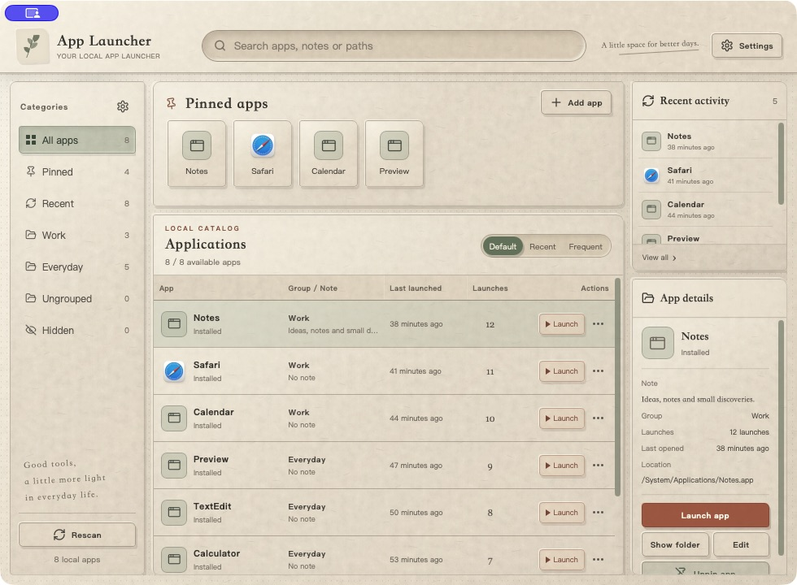
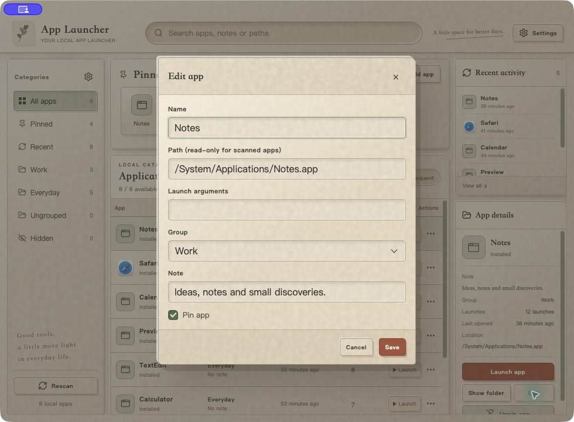
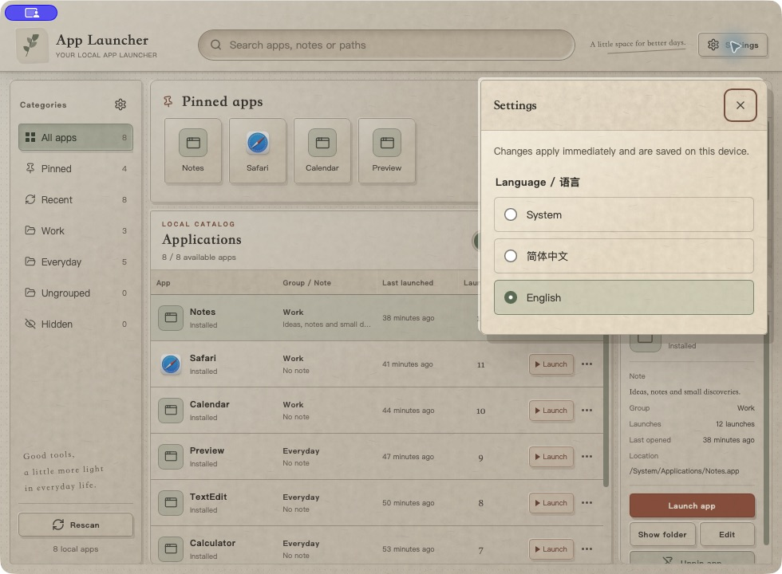

# Hatch


> Hatch is the new name of App Launcher. Existing v0.1.0/v0.2.0 releases and the screenshots below retain the previous branding; this source change does not republish those installers.

**English** | [简体中文](README.zh-CN.md)

A local-first application launcher for macOS and Windows, built with Tauri 2,
React, and Rust. Find your apps, organize your workspace, and launch with less friction.

[Download](https://github.com/piercezzs/hatch/releases) ·
[Report an issue](https://github.com/piercezzs/hatch/issues) ·
[Release guide](docs/releasing.md)

## A look inside



Search, pinned apps, groups, recent activity, and app details in one paper-inspired workspace.



Screenshots show the pre-rebrand build running in a native macOS window,
using an isolated profile with demonstration groups and history. User-created names,
notes, and paths retain their original text when the interface language changes.

## Features

- Search by app name, note, or local path.
- Organize apps into groups; pin favorites and browse recent launches.
- Discover macOS applications and Windows Start Menu / UWP applications.
- Display native app icons, with a placeholder when extraction is unavailable.
- Add custom local paths and launch arguments; edit notes and hide unwanted entries.
- Switch between English and Simplified Chinese, or follow your system language.
- Keep app data on your device. No account or remote service is needed to launch apps.

## Download and install

Get the installer for your computer from [Releases](https://github.com/piercezzs/hatch/releases).
Expand **Assets** on a release page; the source ZIP/TAR archives are not installers.

| Computer | Installer |
| --- | --- |
| Mac with Apple Silicon (M-series) | `*_aarch64.dmg` |
| Mac with an Intel processor | `*_x64.dmg` |
| Windows x64 | `*_x64-setup.exe` |

On macOS, open the DMG and drag the app into Applications. On Windows, run the
installer and follow its prompts. Linux and mobile are not supported.

**Release status:** v0.2.0 is a public preview with bilingual settings and background
application scanning. The earlier v0.1.0 installers do not include language switching.
See [Releases](https://github.com/piercezzs/hatch/releases) for available installers.

macOS packages use ad-hoc signing and are **not notarized**. Windows installers
are **not publisher-signed**. Your operating system may warn or block them.
Do not disable system security globally. Official signing and notarization remain
separate release work. In-app automatic updates are not implemented; download and
install newer releases manually.

Native builds are configured for all three targets. macOS Apple Silicon has local
runtime evidence. Full Windows scan/icon/launch/window acceptance and physical
Intel Mac acceptance remain pending; build success alone does not establish them.

## Language



Open **Settings** in the top-right corner and choose a language:

- **System**: follow the primary language preference exposed by the system WebView.
  Chinese variants use Simplified Chinese; other languages fall back to English.
- **简体中文** or **English**: apply an explicit choice immediately.

The choice is stored locally and restored on restart. Switching keeps your search
and selection. Dates, relative times, built-in categories, and
name-sort tie-breaks follow the selected language. Your app names, groups, notes,
and paths are not translated or rewritten.

## Development

Install Node.js 22 (22.12 or later), pnpm 10.25.0, Rust, and the
[Tauri platform prerequisites](https://v2.tauri.app/start/prerequisites/).
macOS needs Xcode command-line tools. Windows needs MSVC C++ build tools and WebView2.
CI uses Rust 1.96.0.

From the repository root:

```sh
pnpm install --frozen-lockfile
pnpm check
pnpm test
pnpm dev
```

Build a native installer on its supported host:

```sh
pnpm build
```

For a verified local macOS `.app` (current Mac architecture), run from the repository root:

```sh
pnpm desktop:build:local
```

This builds the frontend and Rust app, applies an ad-hoc signature, verifies the
signature, and compares bundled license files with their sources. Any failed step
stops the command with a nonzero exit code. The verified output path is printed at
the end; the first build for an explicit architecture may take longer.
This local command does not notarize, install, upload, or publish the app.

`pnpm test` runs the language tests and Rust tests. The frontend development port
is `1430`. `pnpm --filter hatch dev` starts a renderer-only preview; native
scan and launch actions require the Tauri runtime.

## Repository and translation maintenance

```text
apps/hatch/                   React frontend and Tauri/Rust shell
apps/hatch/src/locales/        English and Simplified Chinese dictionaries
packages/ui/                  Repository-local UI components
docs/images/                  Native application screenshots
.github/workflows/            Checks, installers, and draft releases
```

Maintain both dictionaries together. Use translation keys and interpolation for
interface copy, and preserve plural forms. Keep this README and `README.zh-CN.md`
aligned, including screenshots, download status, and known limitations. See
[localization notes](docs/localization.md) and [release instructions](docs/releasing.md).

This is an independent repository. Its internal `@tessera/ui` name is retained for
import compatibility; the package is maintained here and is not synchronized with
another repository.

## Local data and privacy

App records live in the operating system's app-data directory, under `launcher/`:
`device.json` (custom entries), `overlay.json` (groups and overrides), and
`scan_cache.json` (rebuildable discovery data). The identifier remains
`com.tessera.app-launcher` for application identity and data continuity.
Installer upgrade behavior is separate; see the [branding transition](docs/releasing.md#hatch-branding-transition).

The language preference uses the application's local WebView storage, separately
from app records. Installed paths, groups, icons, and launch history stay on the
device. There is no telemetry or account service. Translation dictionaries ship
with the app and work offline. Missing apps never trigger remote downloads.
GitHub downloads are governed by GitHub's policies.

## Known limitations

- Drag-and-drop ordering and macOS Assets.car-only icon extraction are not implemented.
- Full target-host acceptance and production signing remain pending as described above.
- Backups are manual; stop the app before copying its data. Backing up only the
  three JSON files does not include the separate WebView language preference.

See [architecture and acceptance](docs/architecture.md). For bugs, include your
platform, app version, interface language, and steps to reproduce in an
[issue](https://github.com/piercezzs/hatch/issues), without private paths or credentials.

## License

Copyright (c) 2026 piercezzs. Original code is licensed under the GNU General Public
License version 3 only (`GPL-3.0-only`); see [LICENSE](LICENSE). Use, modification,
and redistribution are subject to those terms. The software comes without warranty.
Third-party components retain their own licenses; see
[THIRD_PARTY_NOTICES.txt](THIRD_PARTY_NOTICES.txt).

Binary releases must provide access to matching complete corresponding source,
including build configuration and this repository's UI package.
