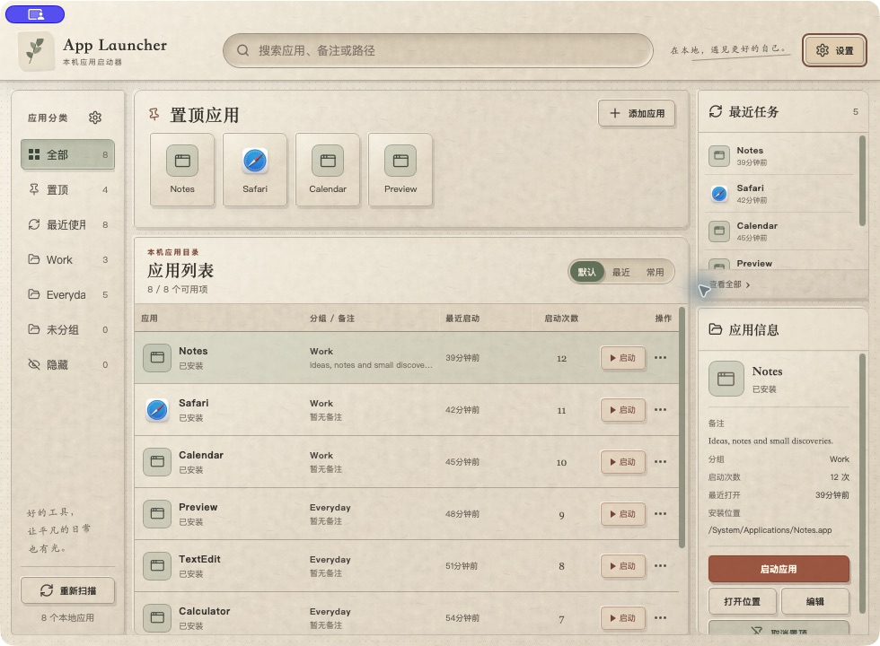
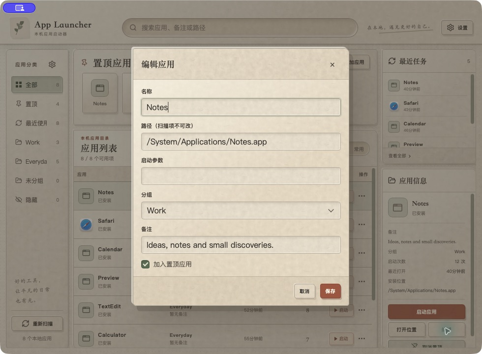
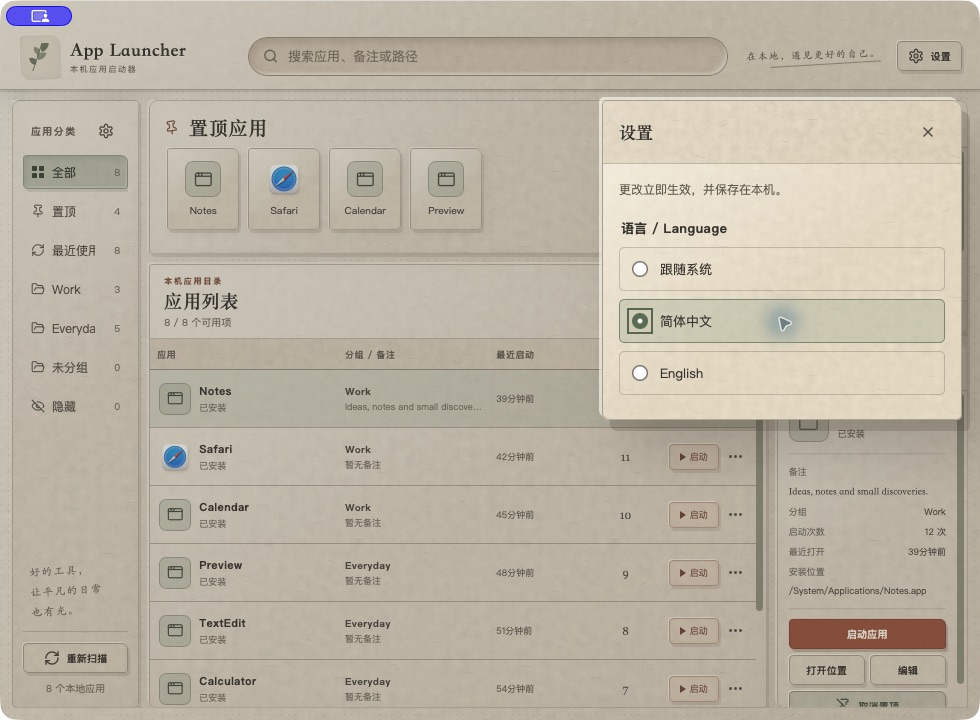

# Hatch


> Hatch 是 App Launcher 的新名称。v0.3.0 开始使用 Hatch 名称及新图标；历史发布包与下方截图仍保留旧品牌。

[English](README.md) | **简体中文**

一款基于 Tauri 2、React 和 Rust 的本地应用启动器，支持 macOS 与 Windows。
快速查找应用、整理工作空间，让日常启动更顺手。

[下载安装](https://github.com/piercezzs/hatch/releases) ·
[反馈问题](https://github.com/piercezzs/hatch/issues) ·
[版本发布指南（英文）](docs/releasing.md)

## 界面预览



搜索、置顶应用、分组、最近使用和应用详情，集中在纸感工作界面中。



截图来自更名前版本的真实 macOS 原生窗口，使用独立数据目录及演示分组、历史记录。
切换界面语言时，用户创建的名称、备注和路径保留原文。

## 功能

- 按应用名称、备注或本地路径搜索。
- 创建应用分组、置顶常用工具、查看最近启动记录。
- 发现 macOS 应用以及 Windows 开始菜单和 UWP 应用。
- 显示原生应用图标，无法提取时使用占位图标。
- 添加自定义本地路径和启动参数，编辑备注、隐藏不需要的条目。
- 支持简体中文、English，以及跟随系统语言。
- 应用数据保存在本机，启动应用无需账号或远程服务。

## 下载与安装

进入 [Releases](https://github.com/piercezzs/hatch/releases)，选择适合电脑的安装包。
展开版本页面中的 **Assets**；Source code ZIP/TAR 是源码压缩包，不是安装包。

| 电脑类型 | 安装包 |
| --- | --- |
| Apple Silicon 芯片的 Mac（M 系列） | `*_aarch64.dmg` |
| Intel 芯片的 Mac | `*_x64.dmg` |
| Windows x64 | `*_x64-setup.exe` |

macOS：打开 DMG，将应用拖入 Applications。Windows：运行安装程序并按提示操作。
目前不支持 Linux 和移动平台。

**已有安装：** macOS 打开 Hatch 前请先退出 App Launcher；复制 Hatch.app 不会替换旧 App Launcher.app，请勿同时运行两个版本。
Windows v0.3.0 预览包仅面向全新安装，尚不支持或保证从旧 App Launcher 升级；已有用户请继续使用旧版，等待迁移路径验证完成。

**发布状态：** v0.3.0 为公开预览版，采用 Hatch 名称及新图标，保留中英设置和后台应用扫描。
变化及安装边界见 [v0.3.0 发布说明](docs/releases/v0.3.0.md)。
较早的 v0.1.0 安装包不包含语言切换，请从 [Releases](https://github.com/piercezzs/hatch/releases) 获取可用安装包。

macOS 安装包使用临时签名，**尚未进行 Apple 公证**；Windows 安装包
**尚未进行发布者签名**。系统可能显示提示或拦截安装、启动。请勿全局关闭系统安全保护。
正式签名及公证仍是独立的后续工作。目前尚未实现应用内自动更新，新版本需手动下载安装。

三个目标平台均已配置原生构建。macOS Apple Silicon 已有本机运行证据；
Windows 扫描、图标、启动及窗口行为的完整实机验收，以及 Intel Mac 实机验收仍待完成。
构建成功不等于完成对应平台的运行验收。

## 语言切换



打开右上角的 **设置**，选择应用语言：

- **跟随系统**：跟随系统 WebView 提供的首选语言；中文变体使用简体中文，其他语言回退英文。
- **简体中文**或 **English**：立即切换为指定语言。

选择保存在本机，重启后自动恢复。切换时保留搜索条件和当前选择。
日期、相对时间、内置分类，以及名称排序的同优先级比较随语言变化。
应用名称、自定义分组、备注和路径不会被翻译或改写。

## 本地开发

安装 Node.js 22（至少 22.12）、pnpm 10.25.0、Rust，以及
[Tauri 平台依赖](https://v2.tauri.app/start/prerequisites/)。
macOS 需要 Xcode 命令行工具；Windows 需要 MSVC C++ 构建工具和 WebView2。
CI 使用 Rust 1.96.0。

在仓库根目录运行：

```sh
pnpm install --frozen-lockfile
pnpm check
pnpm test
pnpm dev
```

在对应平台构建原生安装包：

```sh
pnpm build
```

在 macOS 上，从仓库根目录执行下面的命令，可生成并校验当前 Mac 架构的 `.app`：

```sh
pnpm desktop:build:local
```

命令依次构建前端和 Rust 应用、添加 ad-hoc 签名、校验签名，并逐字节比对包内许可证文件。
任何一步失败都会停止并返回非零退出码；成功后会输出应用包路径。首次按明确架构构建可能较慢。
此本地命令不会进行 Apple 公证、安装、上传或发布。

`pnpm test` 执行国际化测试及 Rust 测试。前端开发端口为 `1430`。
`pnpm --filter hatch dev` 仅启动前端预览；原生扫描和启动操作需要 Tauri 运行时。

## 仓库与翻译维护

```text
apps/hatch/                   React 前端及 Tauri/Rust 桌面外壳
apps/hatch/src/locales/        英文、简体中文词典
packages/ui/                  本仓库独立维护的 UI 组件
docs/images/                  原生应用运行截图
.github/workflows/            检查、安装包构建及 Release 草稿
```

新增界面文案时同时维护两份词典，使用文案键和参数插值，并保留英文单复数形式。
两份 README 的功能、截图、下载状态和已知限制也应同步维护。
参见[国际化维护说明（英文）](docs/localization.md)和[版本发布指南（英文）](docs/releasing.md)。

这是一个独立仓库。内部包名 `@tessera/ui` 为兼容现有导入而保留，
组件仅在此仓库维护，不与其他仓库同步。

## 本地数据与隐私

应用记录位于操作系统应用数据目录下的 `launcher/`：
`device.json` 保存自定义条目，`overlay.json` 保存分组和用户覆盖信息，
`scan_cache.json` 保存可重新生成的扫描缓存。
应用标识仍为 `com.tessera.app-launcher`，以保持应用标识及数据连续性。安装器的升级识别需要单独处理，详见[品牌迁移说明（英文）](docs/releasing.md#hatch-branding-transition)。

语言偏好单独保存在应用的本地 WebView 存储中。应用路径、分组、图标和启动历史留在本机。
本工具不提供遥测或账号服务；翻译词典随应用打包，离线可用。
应用路径失效不会触发远程下载。GitHub 下载行为受 GitHub 自身政策约束。

## 已知限制

- 尚未实现拖拽排序，以及仅存在于 macOS Assets.car 中的图标提取。
- 完整目标平台验收和正式签名仍待完成，详见上方说明。
- 数据备份目前需要手动执行，请先退出应用；仅备份三个 JSON 文件不包含独立的 WebView 语言偏好。

更多信息见[架构与验收说明（英文）](docs/architecture.md)。反馈问题时请提供平台、应用版本、
界面语言和复现步骤，并避免包含私人路径或凭据：[提交 Issue](https://github.com/piercezzs/hatch/issues)。

## 许可证

Copyright (c) 2026 piercezzs。项目原创代码采用 GNU General Public License 第 3 版，
仅此版本（`GPL-3.0-only`），详见 [LICENSE](LICENSE)。使用、修改和再分发需遵守其条款，
软件不提供担保。第三方组件保留各自许可，详见 [THIRD_PARTY_NOTICES.txt](THIRD_PARTY_NOTICES.txt)。

发布二进制安装包时，必须提供与其对应的完整源码访问方式，包括构建配置及本仓库的 UI 组件。
